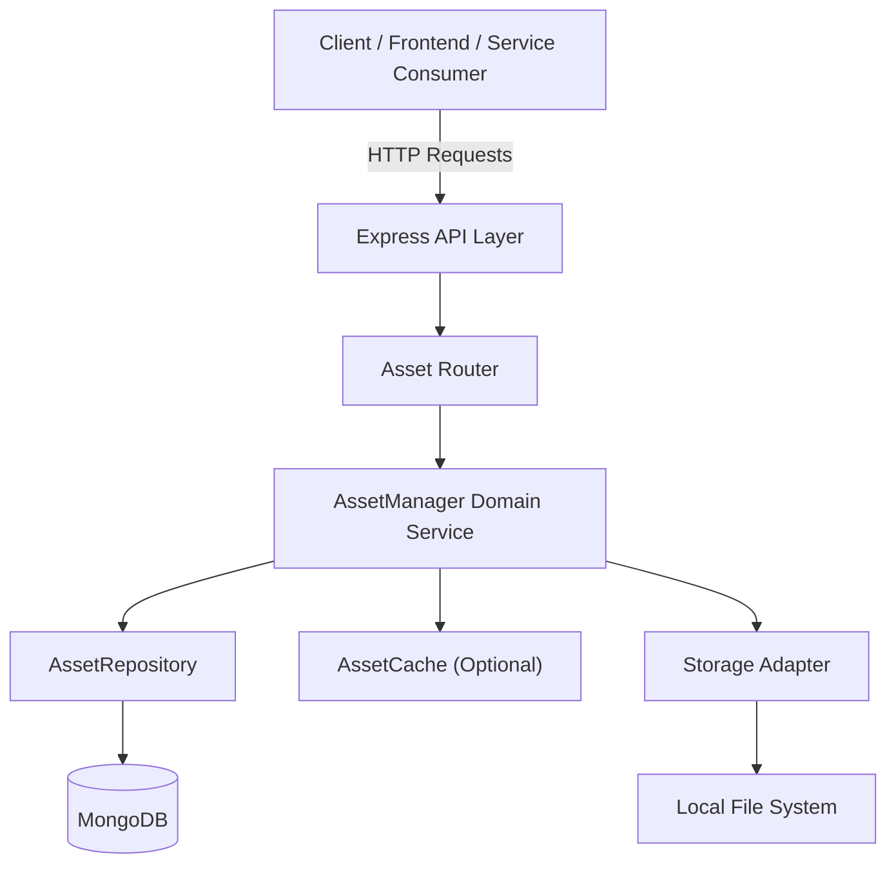

# m1as – MERN-First Asset Service (POC v1.0.0)

## Overview

**m1as (MERN-First Asset Service)** is a backend-first asset management service designed to validate a modular, production-oriented architecture for handling digital assets (uploads, storage, metadata, and retrieval) within a MERN ecosystem.

This framework focuses on:
* Compatibility with modern Node.js LTS environments
---

## Technology Stack

### Backend

* **Node.js** (20 LTS)
* **Express** (API layer)
* **MongoDB** (asset metadata persistence)
* **Multer** (multipart upload handling)
* **file-type** (buffer-based MIME detection)

### Tooling

* **TypeScript** (type safety and maintainability)
* **npm** (10.x)
* **GitHub** (version control, issues, hardening workflow)

---

## High-Level Architecture



---

## Architectural Principles

### 1. Backend-First Design

The asset service is designed to operate independently of any frontend application. This ensures:

* Reusability across multiple clients
* Stability during frontend outages
* Clear API contracts

### 2. Domain-Centric Asset Management

The `AssetManager` acts as the central orchestration layer responsible for:

* Validating asset inputs
* Coordinating storage and persistence
* Enforcing future business rules

### 3. Pluggable Storage Adapters

Storage is abstracted behind a contract, allowing:

* Mongo filesystem storage
* Future cloud adapters (S3, R2, GCS)
* No API-level changes when swapping storage backends

---

## Current Capabilities (v1.0.0)

* Asset upload via multipart/form-data
* Secure server-side file type detection
* Metadata persistence to MongoDB
* Deterministic storage paths
* Decoupled storage and repository layers

---

## warning (POC Scope)

the following in not handled with this version of the code.
* Authentication / authorization
* CDN or public asset delivery
* Rate limiting or abuse protection
* Virus scanning

These concerns are intentionally deferred to the **hardening phase**.

---

## Repository Structure (Simplified)

```
/asset-service
  /api
    /routes
      assetsRouter.ts
  /core
    /assets
      assetManager.ts
      contracts.ts
      types.ts
  /infrastructure
    /storage
      localStorageAdapter.ts
    /repository
      mongoAssetRepository.ts
  server.ts
```

---

## Environment Requirements

* Node.js **20.x LTS**
* npm **10.x**
* MongoDB (local or managed)

```bash
node -v
npm -v
```

---

## Getting Started (POC)

```bash
npm install
npm run build
npm run m1asTest
```

---

## how to evaluate
1. open a gitbash terminal and execute the npm scripts listed in the Getting Started section
2. after m1as is running the service should report ok status on the health check http://localhost:${PORT}$/health
3. Files can be uploaded by opening an auxillary gitbash terminal and executing the following curl:
```ruby
curl -v -X POST http://localhost:${PORT}$/assets \
  -H "x-user-id: ANY-USER-123" \
  -F "file=@C:<your-filepath>/<your-file>.png"
```
4. files can be retrieved by navigating to the following url
```ruby
http://localhost:<PORT>/assets/<id>/file
```
5. metadata can be retrieved by navigating to the to following url
```ruby
http://localhost:<PORT>/assets/<id>
```
6. to delete a file execute the following curl
```ruby
curl -v -X DELETE http://localhost:${PORT}$/assets/<id> \
```
---

## Versioning

This repository represents:

* **m1as – v1.0.0**

Breaking changes are expected prior to a production release.

---

## Hardening Initiative (Next Phase)

The next phase will be conducted in a **separate Quartzion-owned clone** of this repository and tracked via GitHub Issues.

Planned focus areas include:

* Input validation & schema enforcement
* Authentication & authorization hooks
* Rate limiting & abuse prevention
* Secure headers & transport guarantees
* Observability (logging, metrics)
* Storage encryption & integrity checks

---

## Ownership & Attribution

Developed by Peter J Smith (peteCodes4u) for **Quartzion Technology Solutions Corp.**

This project is part of Quartzion’s broader mission to build ethical, scalable, and resilient technology systems.

---

## Status

🚧 **Proof of Concept – Active Development**


mern-asset-service/
```ruby
├─ adapters/
|  └─ express/
│     ├─ assetRouter.ts
│     └─ index.ts
│
├─ core/
|  └─ assets/
│     ├─ assetManager.ts        ← storage + validation
│     ├─ mongoAssetRepo.ts     ← MongoDB logic
│     ├─ index.ts
│     ├─ mongooseModels.ts
│     ├─ contracts.ts
│     └─ types.ts
│
├─ server/
│  ├─ inMemoryAssetRepo.ts   ← m1as 1 (a)
│  └─ m1asServer.ts
|  └─ db/
│     └─ mongoClient.ts  
│
├─ storage/
│  └─ mongo/
│     ├─ index.ts   ← m1as 1 (a)
│     └─ mongoStorageAdapter.ts  
│
│
├─ .gitignore
├─ LICENSE
├─ package.json
├─ README.md
└─ tsconfig.json
```
